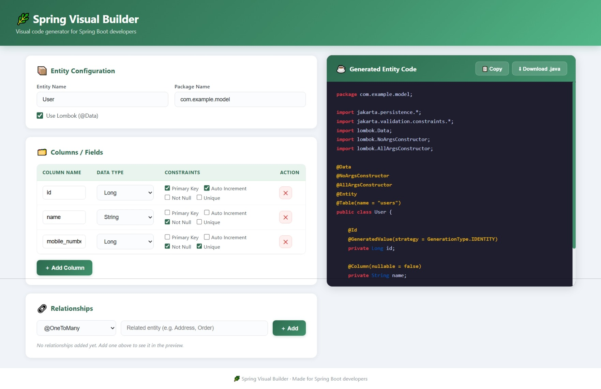

# 🌿 Spring Visual Builder

A **visual low-code tool** for generating Spring Boot `@Entity` classes — no boilerplate, no guesswork.  
Design your entities visually with columns, data types, constraints, and relationships, then instantly get production-ready Java code with **real-time syntax-highlighted preview**.

---

## 📸 Screenshot



---

## ✨ Features

- ✅ **Visual Entity Designer** — add columns, choose data types (`String`, `Long`, `Integer`, `Boolean`, `Double`, `LocalDate`, `LocalDateTime`), and apply constraints (`Primary Key`, `Auto Increment`, `Not Null`, `Unique`)
- ✅ **Relationship Mapper** — support for `@OneToOne`, `@OneToMany`, `@ManyToOne`, and `@ManyToMany` relationships
- ✅ **Lombok Toggle** — optionally generate `@Data`, `@NoArgsConstructor`, `@AllArgsConstructor` annotations
- ✅ **Real-Time Code Preview** — syntax-highlighted Java code updates live as you design
- ✅ **Copy to Clipboard** — one-click copy with toast notification
- ✅ **Download as `.java`** — export the generated entity class as a ready-to-use Java file
- ✅ **Responsive Design** — works on desktop and tablet screens

---

## 🛠️ Tech Stack

| Layer      | Technology                  |
|------------|-----------------------------|
| Frontend   | React 18                    |
| Styling    | Inline CSS + CSS Animations |
| Tooling    | Create React App (react-scripts 5) |

---

## 🚀 Getting Started

### Prerequisites
- [Node.js](https://nodejs.org/) (v16 or later)
- npm (comes with Node.js)

### Installation

```bash
# Clone the repository
git clone https://github.com/Gulshan-Chouksey/spring-visual-builder.git
cd spring-visual-builder

# Install dependencies
npm install

# Start the development server
npm start
```

The app will open at [http://localhost:3000](http://localhost:3000).

---

## 📂 Project Structure

```
spring-visual-builder/
├── public/
│   └── index.html          # HTML entry point
├── src/
│   ├── App.js              # Main app — UI, logic & code generator
│   └── index.js            # React DOM entry
├── package.json
└── README.md
```

---

## 🎯 Roadmap

- [ ] Service Class Generator
- [ ] REST Controller Generator
- [ ] Repository Interface Generator
- [ ] Full Spring Boot project export as ZIP
- [ ] Dark mode theme

---

## 👨‍💻 Author

**Gulshan Chouksey**  
GitHub: [@Gulshan-Chouksey](https://github.com/Gulshan-Chouksey)

---

## 📄 License

This project is open source and available under the [MIT License](LICENSE).